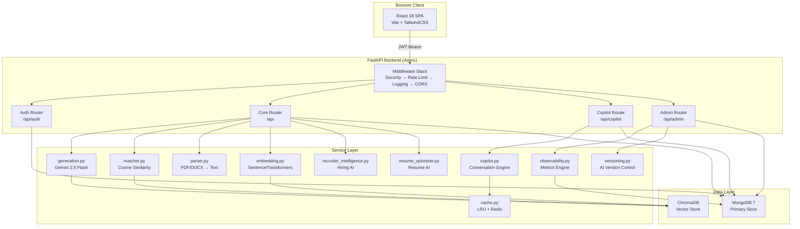
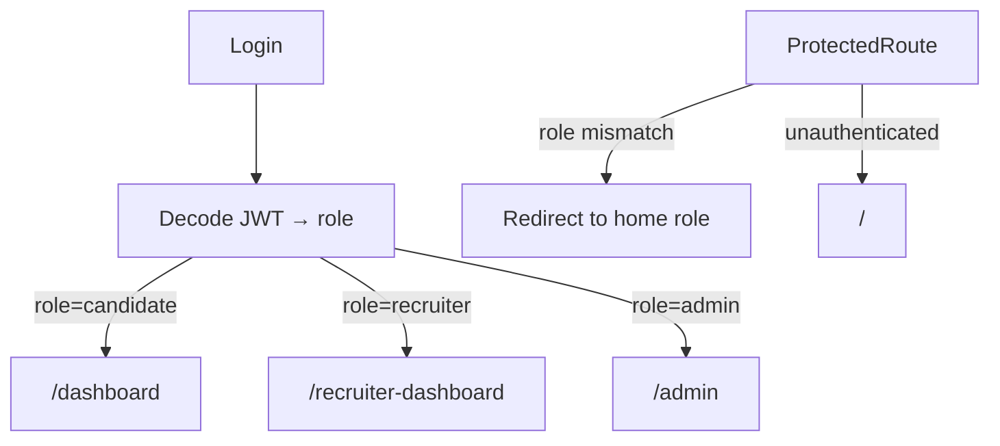
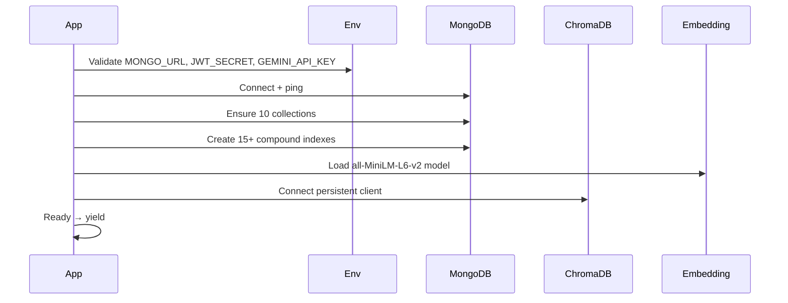
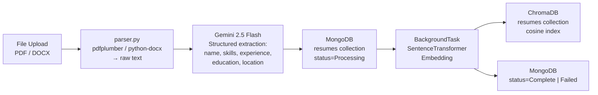
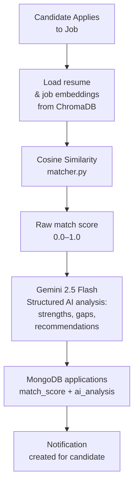
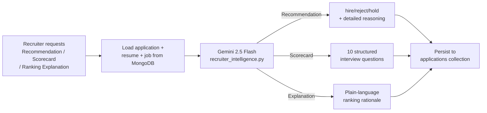
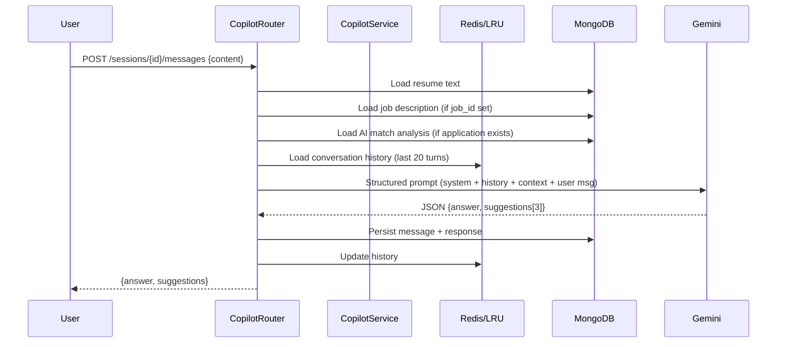
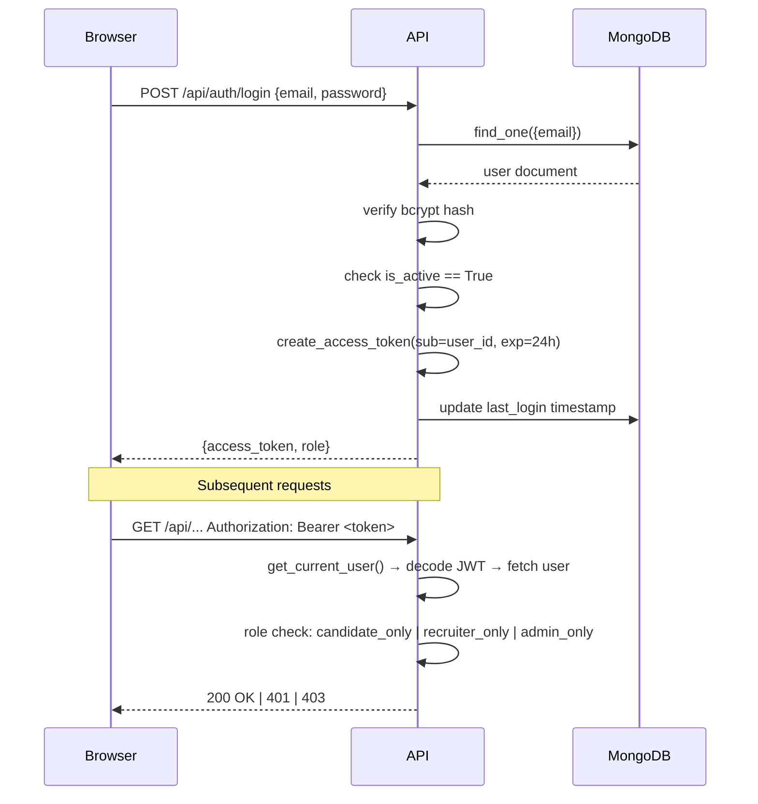
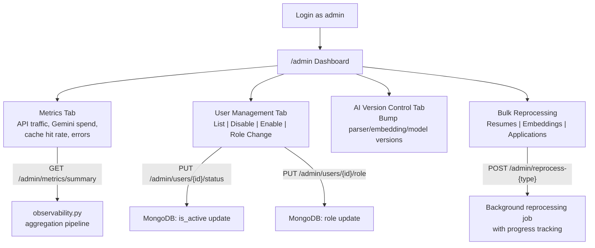
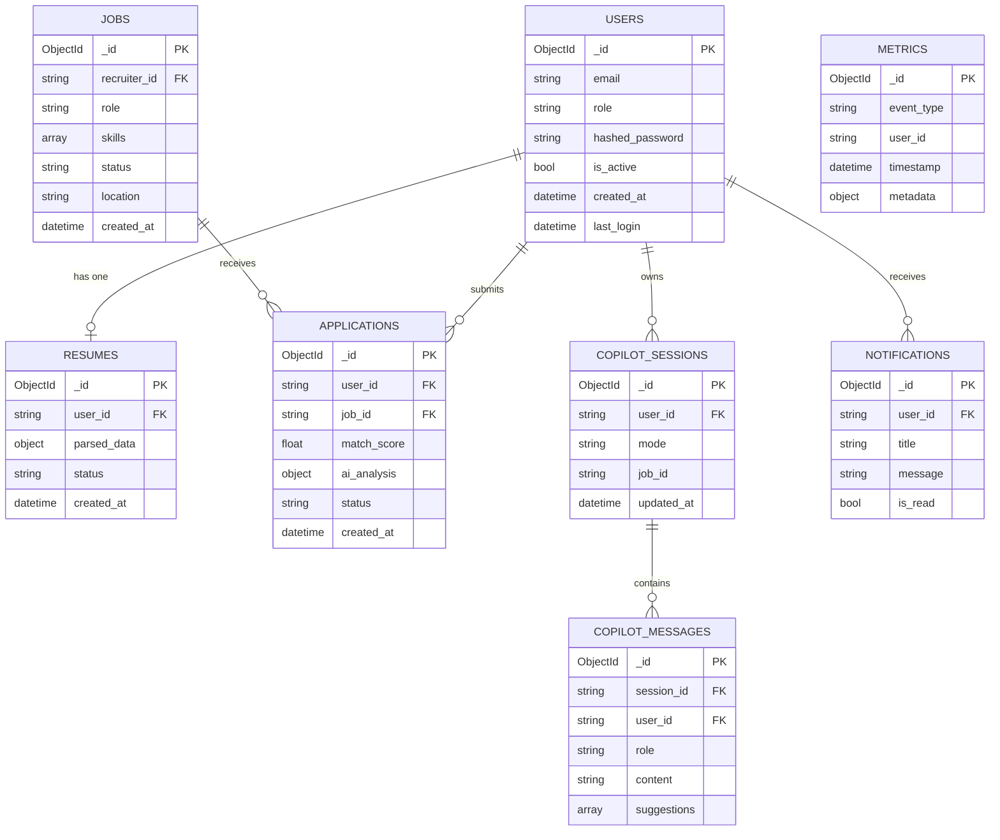

# TalentAI — Architecture Documentation

This document describes the internal architecture of TalentAI, including system design decisions, data flows, and component interactions.

---

## 1. High-Level System Architecture



---

## 2. Frontend Architecture

### Route Structure
```
src/
├── App.jsx                 # Root router + ProtectedRoute RBAC
├── context/
│   └── AuthContext.jsx     # JWT decode, user state, login/logout
├── api/
│   └── axios.js            # Axios instance with Bearer token interceptor
├── components/
│   ├── Layout.jsx          # Sidebar + notification panel (role-aware)
│   └── Skeleton.jsx        # Loading state primitive
└── pages/
    ├── Home.jsx                    # Public landing page
    ├── Login.jsx / Register.jsx    # Auth pages
    ├── CandidateDashboard.jsx      # Candidate home
    ├── UploadResume.jsx            # Resume upload + status polling
    ├── FindJobs.jsx                # Semantic job search + filters
    ├── CopilotChat.jsx             # Candidate AI copilot
    ├── CandidateAiInsight.jsx      # Match insights per application
    ├── ResumeOptimizer.jsx         # Resume ↔ JD optimization
    ├── ApplicationStatus.jsx       # Application tracker
    ├── Profile.jsx                 # Profile management
    ├── RecruiterDashboard.jsx      # Recruiter home
    ├── JobsList.jsx                # Recruiter's job management
    ├── PostJob.jsx                 # Job creation form
    ├── ApplicantManagement.jsx     # Candidate pipeline
    ├── CandidateComparison.jsx     # Side-by-side comparison
    ├── InterviewScorecard.jsx      # AI scorecard viewer
    ├── RecruiterCopilot.jsx        # Recruiter AI copilot
    └── AdminDashboard.jsx          # Platform observability + user mgmt
```

### RBAC Routing


---

## 3. Backend Architecture

### Middleware Stack (Outermost → Innermost)
```
Request
  │
  ▼
SecurityHeadersMiddleware   — CSP, X-Frame-Options, HSTS
  │
  ▼
RateLimitMiddleware         — In-memory, per-IP: 60 req/min default, 10 req/min auth
  │
  ▼
RequestLoggingMiddleware    — Structured JSON logs + X-Request-ID tracing
  │
  ▼
CORSMiddleware              — Origin allowlist from ALLOWED_ORIGINS env
  │
  ▼
FastAPI Router              — Route dispatch
```

### Startup Sequence


---

## 4. AI Pipeline

### 4a. Resume Parsing Pipeline


### 4b. Matching Pipeline


### 4c. Recruiter Intelligence Pipeline


### 4d. Copilot Pipeline


---

## 5. Authentication Flow



---

## 6. Admin Workflow



---

## 7. Database Relationships


